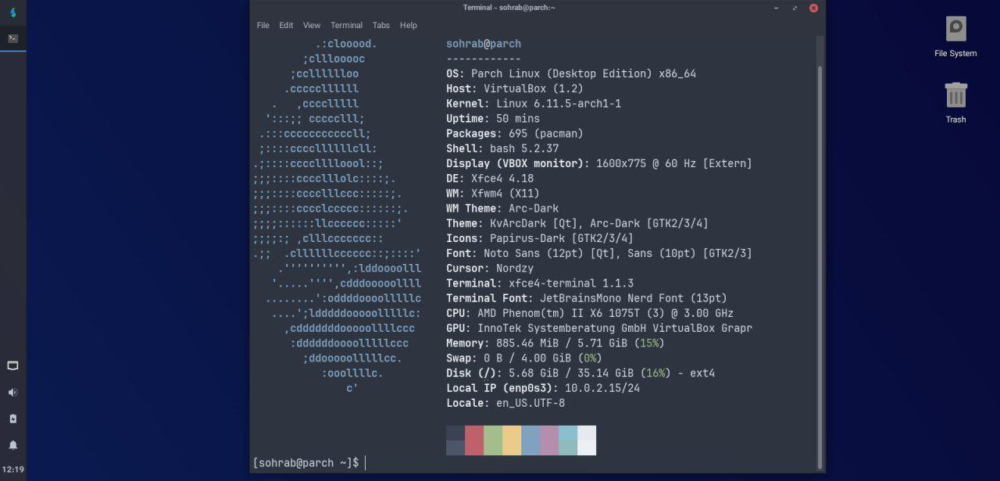

+++
title = "تجربه من با پارچ لینوکس!"
date = "1404-08-15"
description = "تجربه من با توزیع پارچ"
[taxonomies]
tags = ["سیستم_عامل", "بررسی", "نقد", "دیسترو", "لینوکس", "پارچ", "parch"]
+++

سلام بر همه دوست داران لینوکس، این دفعه مطلبی که آماده کردم درباره **توزیع [پارچ لینوکس](https://parchlinux.com)** هست، که یه توزیع خفن و آماده ست.

# پارچ لینوکس چیه؟

پارچ، یه توزیع لینوکسی مبتنی بر آرچه که علاوه بر تمام ویژگی های آرچ، ویژگی های ذاتی زیادی داره که در ادامه بهش می پردازیم.

# چرا پارچ؟

پارچ برای کساییه که دوست دارن وقتشون هدر نره. تقریبا همه چیز از قبل آماده ست و شما با نصب پارچ، بدون نیاز به هیچ پیکربندی ای یه سیستم آماده دارید.

یکی از مزایای پارچ نسبت به توزیع های دیگه اینه که سبکه! پارچ لینوکس طوری طراحی شده که در عین سادگی و کاربرپسند بودن بتونه تجربه ای مثل آرچ برای شما فراهم کنه تا بتونید طعم سادگی رو همراه با قدرت آرچ بچشید!

همچنین پارچ لینوکس به صورت پیش فرض از سه میزکار [گنوم](https://gnome.org) و [پلاسما](https://kde.org) و [xfce](https://xfce.org/) پشتیبانی می کنه، هرچند شما می تونید بعدا هر میزکار و مدیرپنجره ای که تمایل داشتید نصب کنید.

یکی دیگه از مزایای پارچ که برام جالب بود این بود که کار رو ساده کرده، ولی حواسش به این بوده که مثل مانجارو نشه!
مانجارو اینقدر با آرچ اصلی فاصله گرفته که دیگه جزو ساختار آرچ به حساب نمی آد و یه انشعاب مستقل شناخته می شه، به خاطر همین یه سری برنامه ها روش درست کار نمی کنن. تازه مانجارو بسته ها رو از آرچ دیرتر منتشر می کنه که این کارش باعث می شه وابستگی ها بشکنن و مثلا سر یه به روز رسانی ساده سیستم شما داغون بشه.

اما پارچ به جای این که بسته های آرچ رو دستکاری کنه، مستقیم از خود آرچ به روز رسانی می کنه که یعنی سیستم شما همیشه به روزه!

# مقایسه با بقیه توزیع ها

| ویژگی                                        | پارچ | مانجارو |  آرچ  |
|----------------------------------------------|:--:|:-------:|:-----:|
| نصب ساده و گرافیکی                           |✅|✅|❌|
| مخزن کامل تر و غنی تر                        |✅|✅|❌|
| پشتیبانی از [AUR](https://aur.archlinux.org) |✅|✅|✅|
| پشتیبانی از تمام نرم افزار های آرچ-پایه      |✅|✅|✅|
| نزدیک بودن به آرچ                            |✅|❌|✅|
| سبکی                                         |✅|❌|✅|
| استاندارد                                    |✅|❌|✅|

# مزایای پارچ نسبت به آرچ

* میرور داخلی
* سادگی نصب و استفاده
* ابزار های آماده و پیش فرض
* جامعه فارسی و فعال
* اکوسیستم قدرتمند
* قابل اجرا بر روی انواع پردازنده
* دارای نسخه تلفن همراه

# مزایای پارچ نسبت به مانجارو

* سبک
* خالص
* استاندارد
* سازگاری با آرچ
* ساختار منظم iso
* حجم دانلود کمتر
* و راستی، پارچ مثل مانجارو به جایی [دیداس](https://www.linux.org/threads/manjaro-accidently-ddosed-the-aur.34248/) نمی زنه :)

# عکس های پارچ

# دانلود پارچ

# مشخصات پروژه

* [وبسایت](https://parchlinux.com)
* [فروم](https://forum.parchlinux.com)
* [صفحه در distrowatch](https://distrowatch.com/table.php?distribution=parch)
* [کانال تلگرام](https://t.me/parchlinux)
* [ویکی](https://wiki.parchlinux.com)